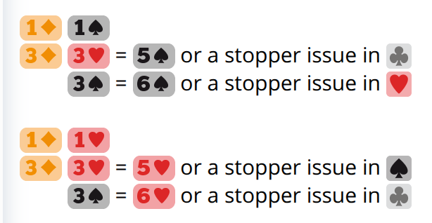

# Competing at the 2-level

Bidding against 1♣♦(1NT) is analogous to a weak notrump.  The agreement to
borrow Landy 2♣ here is also called Landik.

| 1♦(1NT) | - |
|---------|---|
| X       | PEN, INV+
| 2♣!     | UNBAL, 4+♠, 4+♥
| 2NT!    | UNBAL FG

As clubs are directly under diamonds, bidding after 1♦(2♣) is pretty natural.

| 1♦(2♣) | - |
|--------|---|
| X!     | T/O, INV+
| 2♦     | PRE, 4+♦
| 2M     | NF, 5+#
| 2NT    | NAT INV
| 3♣!    | INV+, 4+♦
| 3♦     | CONST, 4+♦
| 3M     | FG, usually 6+#

BTU vs Unusual handles 1♦(2♦) well.  The third cuebid 2NT shows tolerance in
both minors.

| 1♦(2♦) | Both majors |
|--------|-------------|
| X      | PEN for either major
| 2♥!    | FG+, 5+♣
| 2♠!    | INV+, 4+♦
| 2NT!   | INV+, 3+♦, 4+♣
| 3♥♠!   | Ask for stopper

Rubinsohl follows 1♦(2M).  The forcing raise 3♣ and the preemptive raise 3♦
weaponize the diamond fit. FunBridge also inspires the Strawberry adjunct of
3♥♠.

| 1♦(2M) | - |
|--------|---|
| X!     | OPT, INV+
| 2♠     | NF, 5+♠
| 2NT!   | TRF, 5+♣
| 3♣!    | INV+, 4+♦
| 3♦     | NF, 4+♦
| 3♥!    | FG, 5=OM
| 3♥-3♠! | Ask for stopper
| 3♠!    | FG, 6+OM

<figure>
    
    <figcaption>
        The screenshot from
        <a href="https://play.funbridge.com/settings/engine">
            FunBridge game engine specifications (requires login)
        </a>
    </figcaption>
</figure>
