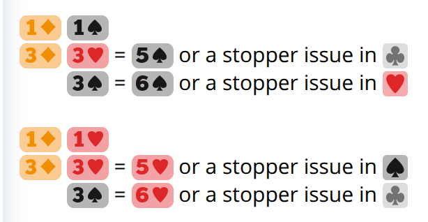

# Competitive bidding

This part shares similarities with [the 1♣ opening](../1C/Competition.md).
There are also differences because 1♦ shows a long suit that allows further
preempts.

## Over (X)

- Notrump transfers to clubs as its natural meaning is not very useful.
- Unlike 1♣ (X), there is no space for Transfer Walsh here.
- Reuse 1♦ (X) 2♣ for Flannery because the rebidding problem persists.

| 1♦ (X) | |
|------|-|
| XX   | NF BAL G/T, 10+
| 1M   | F, 7+, 4+#
| 1NT! | TRF, 7+, 5+♣
| 2♣!  | ART, 5--11, 5+♠, 4+♥
| 2♦   | PRE, 0--7, 4+♦
| 2M   | PRE, 0--7, 6+#
| 2NT! | TRF: (PRE, 7+♣) or (FG, 6+♣)
| 3♣!  | INV+ TRF, 4+♦
| 3♦   | CONST, 8--10, 4+♦
| 3M   | PRE, 7+#

## Over (1♥)

| 1♦ (1♥) | |
|-----|-|
| X!  | TRF, 7+, 4+♠
| 1♠! | TRF to 1NT, 8+
| 1NT | NAT, 8--10
| 2♣  | F, 10+, 5+♣
| 2♦  | CONST, 6--9, 4+♦
| 2♥! | TRF, 6+♠
| 2♠! | INV+, 10+, 4+♦
| 2NT | NAT INV, 10--11
| 3♣  | PRE, 7+♣
| 3♦  | PRE, 0--6, 4+♦
| 3♥! | TRF: (PRE, 7+♠) or (FG, 6+♠)
| 3♠! | Gambling, SOL 7+♣ without stopper

## Over (1♠)

| 1♦ (1♠) | |
|-----|-|
| X!  | NEG, 7+, (4--5♥ or BAL FG)
| 1NT | NAT, 8--10
| 2♣  | F, 10+, 5+♣
| 2♦! | TRF, 10+, 5+♥
| 2♥  | NF, usually 6+♥
| 2♠! | CONST+, 8+, 4+♦
| 2NT | NAT INV, 10--11
| 3♣♥ | PRE, 7+#
| 3♦  | PRE, 0--7, 4+♦
| 3♠! | Gambling, SOL 7+♣ without stopper

## Over (1NT)

Bidding against 1♣♦ (1NT) is analogous to a weak notrump.  The agreement to
borrow Landy 2♣ here is also called Landik.

| 1♦ (1NT) | |
|------|-|
| X    | PEN, INV+
| 2♣!  | UNBAL, 4+♠, 4+♥
| 2NT! | UNBAL FG

After 2♣, advance as in the [Landy defense to 1NT](../Defense/1NT/2C.md).

## Over (2♣)

With clubs directly below diamonds, bidding after 1♦ (2♣) is pretty natural.

| 1♦ (2♣) | |
|-----|-|
| X!  | T/O, INV+
| 2♦  | PRE, 4+♦
| 2M  | NF, 5+#
| 2NT | NAT INV
| 3♣! | INV+, 4+♦
| 3♦  | CONST, 4+♦
| 3M  | FG, usually 6+#

## Over (2♦)

BTU vs Unusual handles 1♦ (2♦) well.  The third cuebid 2NT shows tolerance in
both minors.

| 1♦ (2♦) | Both majors |
|------|---|
| X    | PEN for either major
| 2♥!  | FG+, 5+♣
| 2♠!  | INV+, 4+♦
| 2NT! | INV+, 3+♦, 4+♣
| 3♥♠! | Ask for stopper

## Over (2M)

Rubinsohl follows 1♦ (2M).  The forcing raise 3♣ and the preemptive raise 3♦
put immediate pressure on the opponents with the diamond fit.  FunBridge also
inspired the Strawberry add-on of 3♥♠.

| 1♦ (2M) | |
|----------|-|
| X!       | OPT, INV+
| 2♠       | NF, 5+♠
| 2NT!     | TRF, 5+♣
| 3♣!      | INV+, 4+♦
| 3♦       | NF, 4+♦
| 3♥!      | FG, 5=OM
| 3♥ - 3♠! | Ask for stopper
| 3♠!      | FG, 6+OM

<figure>
    
    <figcaption>
        Screenshot from
        <a href="https://play.funbridge.com/settings/engine">
            FunBridge game engine specifications (requires login)
        </a>
    </figcaption>
</figure>
